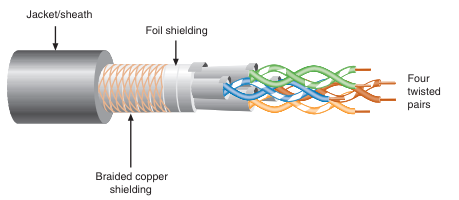
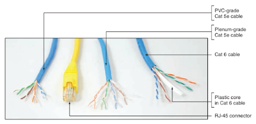
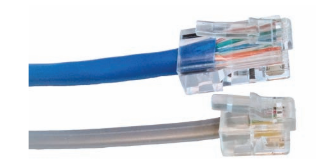
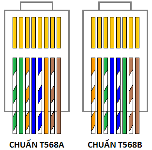
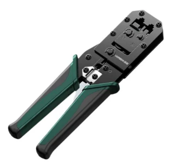
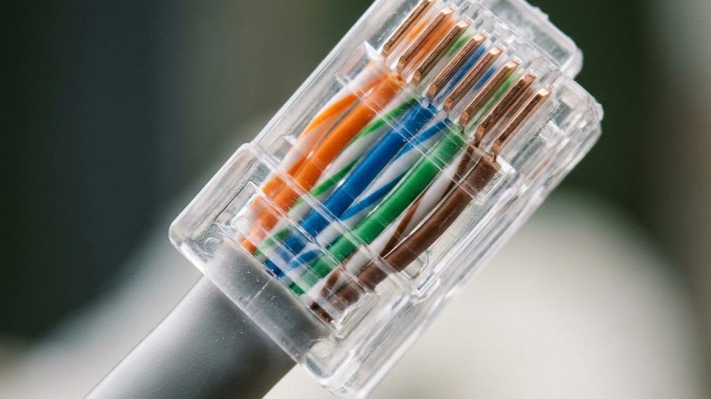

# Laboratory 1 - INTRODUCTION TO NETWORK DEVICES
## 1. Cáp dây xoắn đôi (Twisted-pair)
Cáp xoắn đôi có hai loại: loại có vỏ bọc STP (Shielded Twisted Pair) hoặc loại  không được che chắn UTP (Unshielded Twisted  Pair).
### 1.1. STP

### 1.2. UTP

### 1.3. RJ-45 và RJ-11

### 1.4.  Tiêu chuẩn cáp xoắn đôi

| Tiêu chuẩn (Category) | Tần số tối đa (MHz) | Tốc độ truyền dẫn tối đa (Mbps/Gbps) | Ứng dụng phổ biến | Lưu ý quan trọng |
| :--- | :--- | :--- | :--- | :--- |
| **CAT 5** | 100 MHz | 100 Mbps | Mạng Ethernet 100BASE-TX (Fast Ethernet) | Đã lỗi thời, ít được sử dụng trong các hệ thống mới. |
| **CAT 5e** | 100 MHz | 1 Gbps (1000 Mbps) | Mạng Gigabit Ethernet 1000BASE-T | Tiêu chuẩn tối thiểu phổ biến nhất hiện nay cho mạng gia đình và văn phòng nhỏ. |
| **CAT 6** | 250 MHz | 1 Gbps (ở 100m); **10 Gbps** (ở 37-55m) | Mạng Gigabit Ethernet và 10 Gigabit Ethernet (10GBASE-T) ở khoảng cách ngắn. | Dùng lõi chữ thập (spline) để giảm nhiễu xuyên âm (crosstalk). |
| **CAT 6a** | 500 MHz | **10 Gbps** (ở 100m) | Mạng 10 Gigabit Ethernet (10GBASE-T) trên toàn bộ khoảng cách (100m). | Chữ 'a' (Augmented) nghĩa là "nâng cao", giảm đáng kể nhiễu xuyên âm. |
| **CAT 7** | 600 MHz | 10 Gbps; Hỗ trợ lên đến 40 Gbps/100 Gbps (ở khoảng cách rất ngắn) | Trung tâm dữ liệu (Data Center), cáp bảo vệ (Shielded - STP) cao cấp. | Thường yêu cầu đầu nối không phải RJ45 tiêu chuẩn. |
| **CAT 8** | 2000 MHz | **25 Gbps hoặc 40 Gbps** (ở 30m) | Trung tâm dữ liệu, kết nối máy chủ/thiết bị chuyển mạch hiệu suất cực cao. | Chỉ dành cho kết nối khoảng cách ngắn; là cáp được bảo vệ (Shielded). |

### 1.5. chuẩn bấm dây mạng

- Chuẩn A (T568A): Thường dùng cho các hệ thống cũ hoặc tiêu chuẩn Mỹ.
- Chuẩn B (T568B): Đây là "chân ái"! 99% hệ thống mạng gia đình và văn phòng tại Việt Nam đang dùng chuẩn này. Nếu bạn học để tự sửa mạng nhà mình, hãy học thuộc lòng chuẩn B.
  
  

#### Cáp Thẳng (Straight-through)
Nghĩa là hai đầu dây bạn bấm GIỐNG HỆT NHAU (cùng là chuẩn B hoặc cùng là A). 👉 Dùng khi nối 2 thiết bị KHÁC LOẠI: Modem/Router -> PC/Laptop; Switch -> Máy tính; Tivi -> Modem.
#### Cáp Chéo (Crossover)
Nghĩa là một đầu bạn bấm chuẩn A, đầu kia bấm chuẩn B. 👉 Dùng khi nối 2 thiết bị CÙNG LOẠI: Nối 2 máy tính với nhau (để copy dữ liệu trực tiếp); Nối Switch với Switch; Nối Router với Router.
### 1.6. Kiềm bấm mạng 

### 1.7. Chuẩn hoàn thiện

## 2. Công nghệ không dây
