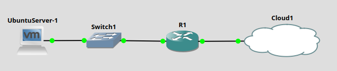

# Laboratory 3 - INTERNET CONNECTION AND NETWORK QUALITY TESTING

## 1. Thiết lập Interface phía trong mạng ảo (VMnet1)
```
R1#configure terminal
R1(config)#interface FastEthernet 0/0
R1(config-if)#ip address 192.168.106.254 255.255.255.0
R1(config-if)# ip nat inside
R1(config-if)# no shutdown
R1(config-if)# exit
```
## 2. Thiết lập Interface phía ngoài mạng ảo (VMnet8)
```
R1#configure terminal
R1(config)#interface FastEthernet 1/1
R1(config-if)#ip address dhcp
R1(config-if)# ip nat outside
R1(config-if)# no shutdown
R1(config-if)# exit
R1(config-)#end
R1#write memory
```
## 3. Access list định nghĩa mạng phía trong
```
R1(config)#access-list 1 permit 192.168.106.0 0.0.0.255
```
## 4. Cấu hình NAT overload
```
R1(config)#ip nat inside source list 1 interface FastEthernet1/1 overload
```
## 5. Đặt default route
```
R1(config)#ip route 0.0.0.0 0.0.0.0 192.168.41.2
```

